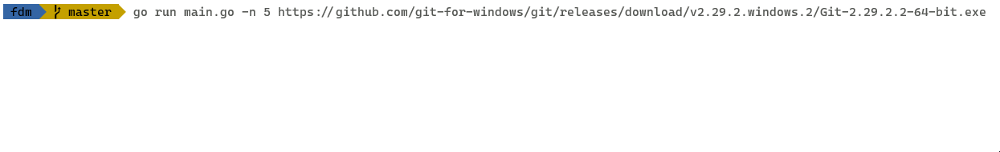

# File Download Manager

IDM-like, just in terminal and without pause/resume capability :)

It's all about working with bytes, splitting request using "range" header and writing the bytes of response to at certain point of a file's bytes (as it satisfies io.Seeker). Exploring io.Writer and io.Reader and how we can intercept the interface to print the progress. That's it!